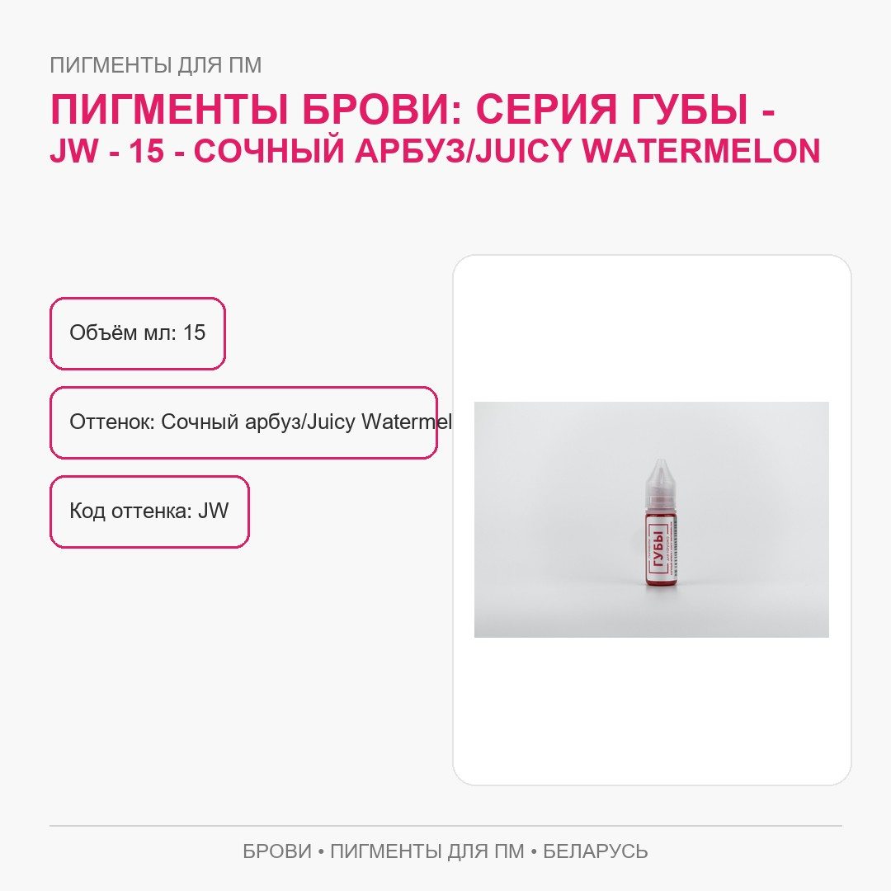
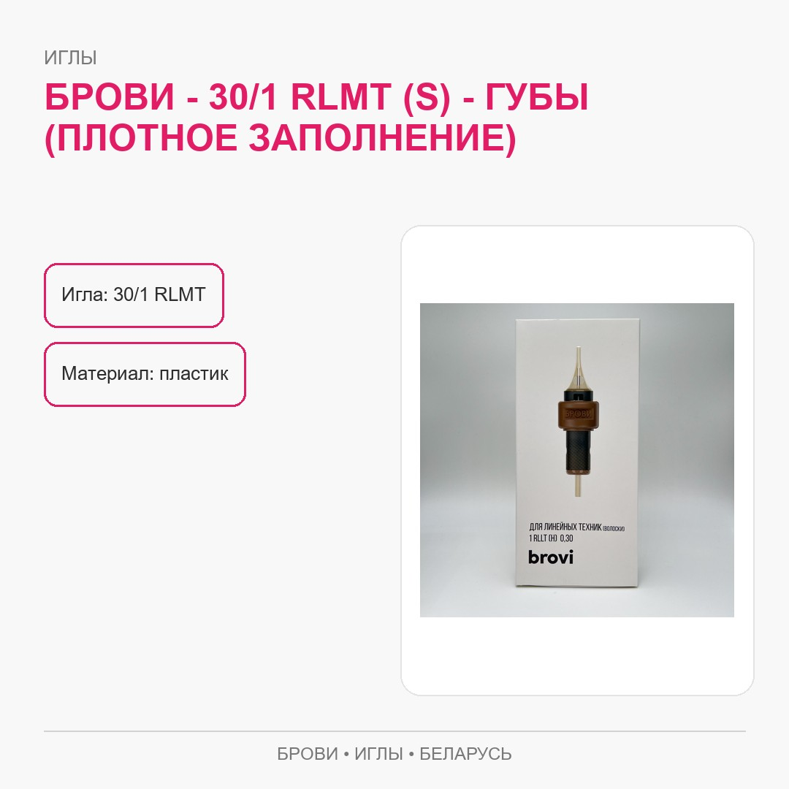

<div align="center">

# PM Market · Product Cards

**Товарная инфографика. Точный вариант. Постоянный путь к файлу.**

Пигменты · Оборудование · Картриджи · Расходные материалы

[Примеры](#примеры-из-библиотеки) · [Найти карточку](#как-найти-нужную-карточку) · [Обновить материал](#как-обновлять-материалы) · [Вход для агента](AGENTS.md) · [English](#english)

</div>

---

Готовые изображения товарных карточек PM Market — для поиска, проверки и дальнейшей публикации в разрешённых каналах. Для просмотра не нужны установка зависимостей или запуск приложения.

**Это библиотека материалов, не исходники магазина.** Название файла связывает изображение с числовым идентификатором товара, наименованием и суффиксом `_infographic.jpg`.

## Примеры из библиотеки

### Расходные материалы · Traditional Soap

<p align="center">
<a href="100070300462_Sashe-Traditional-soap-13-ml_infographic.jpg"></a>
</p>

[Открыть исходный файл](100070300462_Sashe-Traditional-soap-13-ml_infographic.jpg)

<details>
<summary><strong>Ещё два примера: пигмент и картридж</strong></summary>

### Пигменты · BROVI Juicy Watermelon

<p align="center">
<a href="100645945662_Pigmenty-BROVI-Seriya-GUBY-JW-15-Sochnyy-arbuz-Juicy-Waterme_infographic.jpg"></a>
</p>

### Картриджи · BROVI 30/1 RLMT S

<p align="center">
<a href="100921419552_BROVI-30-1-RLMT-S-GUBY-plotnoe-zapolnenie_infographic.jpg"></a>
</p>

</details>

Изображения сохранены без изменений. Открывайте оригинал для проверки мелкого текста; пример карточки не подтверждает текущую цену, наличие или актуальность характеристик.

## Как найти нужную карточку

**Идентификатор → изображение → точный вариант товара → исходный файл.**

Используйте поиск файлов GitHub по идентификатору, бренду или части наименования:

| Фрагмент | Что искать |
| --- | --- |
| `100070300462` | Конкретный товар по идентификатору. |
| `BROVI` или `Kwadron` | Материалы соответствующего бренда. |
| `_infographic.jpg` | Файлы товарной инфографики. |

Откройте найденное изображение, сверьте вариант и скачайте оригинал через интерфейс GitHub. Для одной карточки клонировать всю библиотеку необязательно.

Для работы с набором материалов:

```sh
git clone https://github.com/bouncemonster/pm-market-cards.git
cd pm-market-cards
```

## Как обновлять материалы

**Сохраняйте соответствие «идентификатор → товар → изображение».** Сверяйте бренд, модель или оттенок, объём и упаковку с актуальным источником. Пути уже могут использоваться внешними карточками: не переименовывайте и не перемещайте файлы без проверки этих ссылок.

Проверяйте читаемость текста, пропорции, обрезанные элементы и качество экспорта. Группируйте изменения по понятной товарной задаче. Одинаковые байты в двух файлах не дают автоматического разрешения удалить один из них: разные товарные записи могут иметь разных потребителей.

Временные экспорты, неясные дубликаты, персональные данные и токены в библиотеку не добавляются. Перед коммерческой публикацией сведения о товаре проверяются отдельно от оформления изображения.

## Для агентов и разных IDE

Начните с [AGENTS.md](AGENTS.md). Он фиксирует назначение проекта, сохранность товарных путей, работу с похожими файлами, визуальную проверку и передачу незавершённой задачи.

В handoff нужны точные товарные идентификаторы и пути, исходная ревизия, реально выполненные проверки, опубликованный коммит и следующий шаг. Старый локальный экспорт не должен заменять актуальные файлы GitHub; этот репозиторий не подменяет операции импорта в `pm.market`.

## Границы использования

Библиотека не является системой учёта цен и остатков, инструкцией по процедурам или самостоятельным подтверждением свойств продукции. Права на бренды, фотографии и тексты сохраняются за правообладателями. Публичность файлов не означает произвольного коммерческого разрешения.

---

## English

**PM Market Product Cards** is a visual library of product infographics. Find an asset by product ID or brand, inspect the exact variant and obtain the original image. No application build is required.

Examples use existing files in a single-column presentation rather than squeezing three cards into one row. Preserve published asset paths, verify current product facts separately and read [AGENTS.md](AGENTS.md) before automated changes. This repository is neither the store backend nor its catalog-import workflow.
